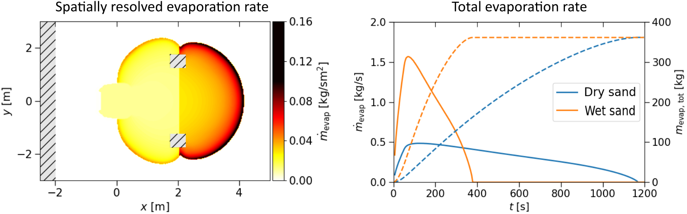

# Cryogenic pool spreading and vaporization
<p align="center"></p>

This repository contains Python code for simulating the spill of liquid ammonia (LNH3) or liquid hydrogen (LH2) onto solid ground. 
The scripts use the Python interface of [Clawpack](https://www.clawpack.org) to solve the shallow water equations. 
Several parameters can be varied including initial spill velocity, ground topography, obstructions, and details 
regarding the thermal properties of the substrate. The variable thermal properties of the substrate have been accounted for when 
calculating heat flux from the ground into the liquid pool. Moreover, both boiling correlations and perfect thermal contact have 
been implemented. For more comprehensive information, please refer to: 
[Effect of substrate thermal properties on evaporating liquid hydrogen and ammonia spills (2024)](https://doi.org/10.1016/j.jlp.2025.105685).

After cloning, pip install requirements by typing 
```bash
pip install -r /path/to/requirements.txt
```
in terminal.

# Disclaimer
The code should be used with caution if assessing risks. The authors disclaim any liability for the interpretation and
application of the results generated by this code. It is the user’s responsibility to ensure the appropriate use of the results.

# Please cite
If you are writing academic publications, please cite the following article:<br />
[Effect of substrate thermal properties on evaporating liquid hydrogen and ammonia spills (2024)](https://doi.org/10.1016/j.jlp.2025.105685).

# License 
This repository is distributed under the [Apache 2.0](https://github.com/martinspgronli/cryogenic_pool_spreading_and_vaporization/blob/c0fd9754d19ae548064d418f9687cf1bfe40c8d7/LICENSE-APACHE) license.

# Acknowledgements 
This work has been developed at SINTEF Energy Research, and was funded by the Research Council of Norway and industry through
the [MaritimeNH3](https://www.sintef.no/prosjekter/2021/maritimenh3/) project, project number 328679. Support has also been 
granted from the [HYDROGENi Research Centre](https://hydrogeni.no), performed under the Norwegian research program 
FMETEKN, project number 333118.
